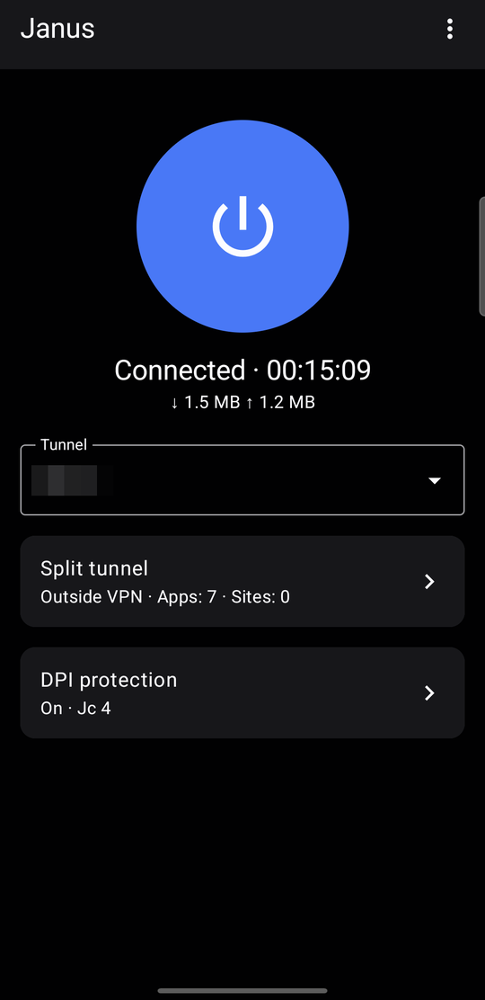
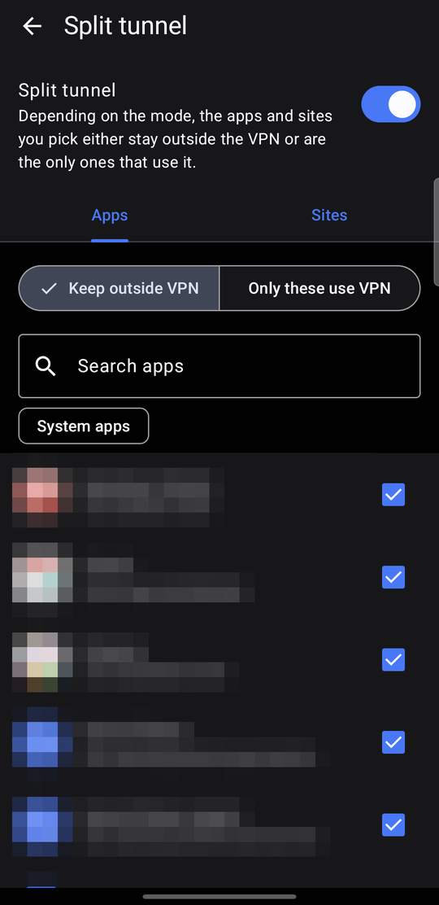
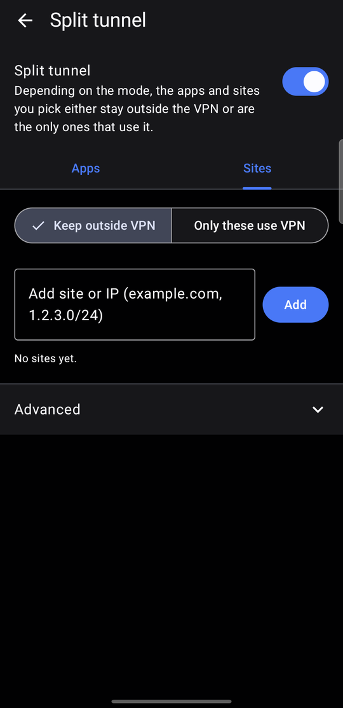

# Janus

**English** · [Türkçe](README.tr.md)

Janus is an Android VPN client for WireGuard and AmneziaWG with **split tunneling by app and by
website**. Choose which apps and sites stay outside the VPN, or send only a chosen few through it.

It works with any standard WireGuard configuration, from a VPN provider or your own server, as
well as AmneziaWG servers. Janus is a fork of
[amneziawg-android](https://github.com/amnezia-vpn/amneziawg-android).

<p align="center">
  
  
  
</p>

## Features

- **Split tunnel by app and by site.** Pick apps from a list and add sites as a domain
  (`example.com`) or an IP / network (`1.2.3.0/24`). Janus finds the IP addresses of the sites by
  itself. Each list works in one of two modes:
  - **Keep outside VPN:** the selected apps and sites go out directly, everything else uses the VPN.
  - **Only these use VPN:** only the selected apps and sites use the VPN.
- **DPI protection:** adds junk packets that can help on networks that block VPN traffic. Works
  with plain WireGuard servers too.
- **Quick Settings tile** to connect or disconnect from the notification shade.
- **Automatic reconnect** when a connection gets stuck.
- **Built-in updates:** new versions are offered inside the app.
- English and Turkish interface.

## Requirements

- Android 7.0 or newer. Site split tunneling needs Android 13 or newer.
- A WireGuard or AmneziaWG configuration.

## Install

Download the APK from the [latest release](https://github.com/aykq/janus/releases/tag/debug-latest)
and open it on your phone.

## Getting started

1. **Add a tunnel:** tap *Add tunnel*, then import a configuration file, scan a QR code or create
   one from scratch. Tap the big button to connect.
2. **Split tunnel:** tap the *Split tunnel* card on the home screen, choose apps and sites, and
   pick a mode. If you are connected, tap *Apply now* to use the new settings right away.

## Privacy

Janus has no accounts, analytics or ads. Besides your VPN server it only connects to GitHub to
check for updates, and to a DNS-over-HTTPS resolver to look up the sites in your split tunnel list.

## Known limitations

- Site split tunneling works on IP addresses. If a site switches to a new address while you are
  connected, that traffic follows the default path until you reconnect.
- Stronger obfuscation settings (S1/S2, H1–H4) need a server that supports them.

## Building from source

```bash
git clone --recurse-submodules https://github.com/aykq/janus.git
cd janus
./gradlew assembleDebug
```

Requires JDK 17, the Android SDK, the Android NDK and Go.

## License

Apache License 2.0, see [COPYING](COPYING). Based on
[amneziawg-android](https://github.com/amnezia-vpn/amneziawg-android) and
[wireguard-android](https://git.zx2c4.com/wireguard-android).
WireGuard is a registered trademark of Jason A. Donenfeld.
